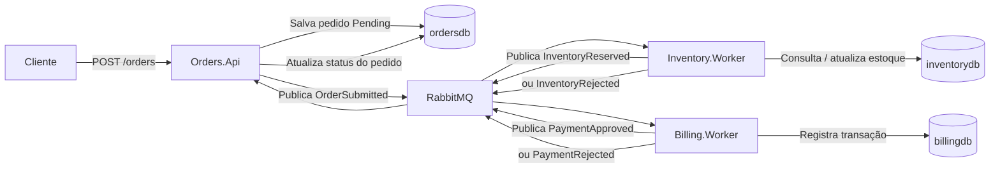

# 🧾 Order System

<div align="center">


**Arquitetura de microsserviços para cadastro e processamento de pedidos**  
**ASP.NET Core + Worker Services + RabbitMQ + MassTransit + PostgreSQL + Docker Compose**

</div>

---

## ✨ Sobre o projeto

O **Order System** é uma solução de estudo e portfólio construída com foco em **arquitetura orientada a eventos** e **comunicação assíncrona entre microsserviços**.

A proposta é simular o ciclo de vida de um pedido, desacoplando responsabilidades em serviços independentes:

- **Orders.Api** → recebe e persiste pedidos
- **Inventory.Worker** → valida e reserva estoque
- **Billing.Worker** → processa pagamento
- **RabbitMQ** → transporta os eventos entre os serviços
- **PostgreSQL** → persiste os dados de cada microsserviço
- **Docker Compose** → sobe todo o ambiente com um único comando

> 💡 Ideal para estudos, testes técnicos, portfólio e base inicial para arquiteturas distribuídas com .NET.

---

## 🏛️ Arquitetura



---

## 🔄 Fluxo de processamento

### 1) Criação do pedido
O cliente envia um `POST /orders` para a API.

### 2) Persistência inicial
A `Orders.Api` grava o pedido com status inicial **Pending**.

### 3) Publicação do evento
A API publica o evento **OrderSubmitted** no RabbitMQ via MassTransit.

### 4) Reserva de estoque
O `Inventory.Worker` consome o evento e verifica a disponibilidade dos itens.

- Se houver estoque suficiente → publica **InventoryReserved**
- Caso contrário → publica **InventoryRejected**

### 5) Processamento do pagamento
O `Billing.Worker` consome **InventoryReserved** e processa o pagamento.

- Se aprovado → publica **PaymentApproved**
- Se recusado → publica **PaymentRejected**

### 6) Atualização do pedido
A `Orders.Api` consome os eventos finais e atualiza o status do pedido.

---

## 📌 Status possíveis do pedido

- `Pending`
- `Completed`
- `InventoryRejected`
- `PaymentRejected`

---

## 🧰 Stack utilizada

### Backend
- **.NET 8**
- **ASP.NET Core Web API**
- **Worker Services**
- **Entity Framework Core**

### Mensageria
- **RabbitMQ**
- **MassTransit**

### Persistência
- **PostgreSQL**

### Infraestrutura
- **Docker**
- **Docker Compose**

---

## 📁 Estrutura do projeto

```bash
OrderSystem/
├── docker-compose.yml
├── src/
│   ├── BuildingBlocks/
│   │   └── Contracts/
│   │       ├── Contracts.csproj
│   │       └── Events/
│   │           └── OrderEvents.cs
│   ├── Services/
│   │   ├── Orders.Api/
│   │   │   ├── Controllers/
│   │   │   ├── Consumers/
│   │   │   ├── Data/
│   │   │   ├── Models/
│   │   │   ├── Program.cs
│   │   │   └── Dockerfile
│   │   ├── Inventory.Worker/
│   │   │   ├── Consumers/
│   │   │   ├── Data/
│   │   │   ├── Models/
│   │   │   ├── Program.cs
│   │   │   └── Dockerfile
│   │   └── Billing.Worker/
│   │       ├── Consumers/
│   │       ├── Data/
│   │       ├── Models/
│   │       ├── Program.cs
│   │       └── Dockerfile
└── docker/
    └── postgres/
        └── init.sql
```

---

## 📦 Eventos de integração

Os microsserviços se comunicam por meio dos seguintes contratos:

- `OrderSubmitted`
- `InventoryReserved`
- `InventoryRejected`
- `PaymentApproved`
- `PaymentRejected`

Todos ficam centralizados em:

```bash
src/BuildingBlocks/Contracts
```

Isso garante **consistência entre produtores e consumidores**.

---

## 🚀 Como executar

### Pré-requisitos

Você precisa ter instalado:

- [.NET SDK 8](https://dotnet.microsoft.com/download)
- [Docker](https://www.docker.com/)
- [Docker Compose](https://docs.docker.com/compose/)

---

### 1. Subir todo o ambiente

Na raiz do projeto, execute:

```bash
docker compose up --build
```

Esse comando sobe:

- PostgreSQL
- RabbitMQ
- Orders.Api
- Inventory.Worker
- Billing.Worker

---

### 2. Acessar os serviços

#### Swagger da API
```bash
http://localhost:5000/swagger
```

#### API
```bash
http://localhost:5000
```

#### RabbitMQ Management
```bash
http://localhost:15672
```

**Credenciais padrão:**

```txt
Usuário: guest
Senha: guest
```

---

## 🗄️ Bancos de dados

A solução utiliza **três bancos independentes** no PostgreSQL, simulando melhor um cenário de microsserviços:

- `ordersdb`
- `inventorydb`
- `billingdb`

Cada serviço é responsável exclusivamente pelo seu contexto de dados.

---

## 🧪 Testando a API

### Criar pedido

**Endpoint**

```http
POST /orders
```

**Payload**

```json
{
  "customerId": "aaaaaaaa-aaaa-aaaa-aaaa-aaaaaaaaaaaa",
  "items": [
    {
      "productId": "11111111-1111-1111-1111-111111111111",
      "productName": "Notebook",
      "quantity": 1,
      "unitPrice": 3500.00
    },
    {
      "productId": "22222222-2222-2222-2222-222222222222",
      "productName": "Mouse",
      "quantity": 2,
      "unitPrice": 120.00
    }
  ]
}
```

**Resposta esperada**

```json
{
  "id": "GUID_DO_PEDIDO",
  "status": "Pending"
}
```

---

### Consultar pedido

```http
GET /orders/{id}
```

Exemplo com `curl`:

```bash
curl http://localhost:5000/orders/SEU_GUID_AQUI
```

---

## 🧪 Exemplo rápido com curl

### Criar pedido

```bash
curl -X POST http://localhost:5000/orders \
  -H "Content-Type: application/json" \
  -d '{
    "customerId": "aaaaaaaa-aaaa-aaaa-aaaa-aaaaaaaaaaaa",
    "items": [
      {
        "productId": "11111111-1111-1111-1111-111111111111",
        "productName": "Notebook",
        "quantity": 1,
        "unitPrice": 3500.00
      }
    ]
  }'
```

---

## 🧱 Migrations

Caso deseje gerar as migrations manualmente:

### Orders.Api

```bash
dotnet ef migrations add InitialCreate \
  --project src/Services/Orders.Api \
  --startup-project src/Services/Orders.Api \
  --output-dir Data/Migrations
```

### Inventory.Worker

```bash
dotnet ef migrations add InitialCreate \
  --project src/Services/Inventory.Worker \
  --startup-project src/Services/Inventory.Worker \
  --output-dir Data/Migrations
```

### Billing.Worker

```bash
dotnet ef migrations add InitialCreate \
  --project src/Services/Billing.Worker \
  --startup-project src/Services/Billing.Worker \
  --output-dir Data/Migrations
```

---

## 🐳 Containers e infraestrutura

Cada serviço possui seu próprio `Dockerfile`, e o ambiente completo é orquestrado por `docker-compose.yml`.

### Benefícios dessa abordagem

- ambiente padronizado
- fácil onboarding
- execução local simplificada
- simulação realista de mensageria + banco + microsserviços

---

## ✅ Regras implementadas no fluxo atual

A versão atual do projeto implementa um fluxo simplificado para fins de demonstração:

- o pedido é criado com status `Pending`
- o estoque é validado pelo `Inventory.Worker`
- o pagamento é simulado pelo `Billing.Worker`
- a conclusão do pedido depende do recebimento do evento `PaymentApproved`

---

## 🌟 Diferenciais técnicos

- Arquitetura orientada a eventos
- Separação clara de responsabilidades
- Comunicação assíncrona com RabbitMQ
- Abstração de mensageria com MassTransit
- Persistência desacoplada por serviço
- Ambiente totalmente containerizado

---

## 🛣️ Roadmap / Próximas melhorias

Este projeto pode evoluir para um cenário mais robusto com:

- [ ] **Outbox Pattern**
- [ ] **Idempotência** no consumo de mensagens
- [ ] **Saga / State Machine** com MassTransit
- [ ] **Retry Policies** por consumer
- [ ] **Dead Letter Queues**
- [ ] **Health Checks**
- [ ] **OpenTelemetry**
- [ ] **Logs estruturados**
- [ ] **Autenticação com JWT**
- [ ] **Testes unitários e de integração**
- [ ] **CI/CD com GitHub Actions**
- [ ] **Monitoramento com Prometheus + Grafana**

---

## 🤝 Contribuição

Contribuições são muito bem-vindas.

### Como contribuir

1. Faça um fork do projeto
2. Crie uma branch para sua feature

```bash
git checkout -b feature/minha-feature
```

3. Commit suas alterações

```bash
git commit -m "feat: minha nova feature"
```

4. Envie para o repositório remoto

```bash
git push origin feature/minha-feature
```

5. Abra um Pull Request 🚀

---

## 📄 Licença

Este projeto está sob a licença **MIT**.

Se quiser, você pode adicionar um arquivo `LICENSE` com o conteúdo padrão da MIT License.

---

## 👨‍💻 Autor

Adicione aqui suas informações:

```md
**Autor:** Seu Nome  
**LinkedIn:** https://linkedin.com/in/seu-link  
**GitHub:** https://github.com/seu-usuario
```

---

## 💬 Considerações finais

Este repositório é uma excelente base para quem deseja estudar **microsserviços com .NET**, **event-driven architecture**, **mensageria com RabbitMQ** e **containerização com Docker**.

Se esse projeto te ajudar, considere deixar uma ⭐ no repositório.

<div align="center">

**Feito com dedicação para estudos, evolução técnica e portfólio.**

</div>
